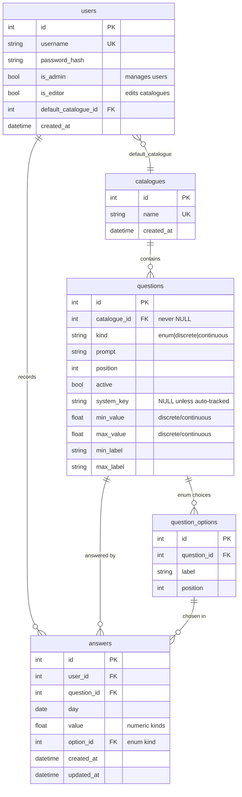

# Happiness Tracker — Implementation Plan

Derived from [README.md](README.md). Covers the data model, the API surface, the test
strategy, and a build order.

## Decisions already taken

| Area | Decision | Consequence |
| --- | --- | --- |
| Question editing | **Freeze once answered.** Bounds, labels, kind and enum options are editable only while a question has zero answers. After that, only `prompt`, ordering and `active` may change. | No versioning tables. Rescaling means deactivate + recreate, which yields two separate series in stats. |
| Auto-tracked fields | **Stored as system questions.** Five seeded, server-owned questions whose answers are written alongside real ones. | Table, xlsx, stats and correlation treat them uniformly — no special-casing downstream. Costs write-time bookkeeping. |
| "Today" | **Client-local date.** The frontend sends the calendar day and its local hour; the backend never derives a date from server time. | `answers.day` is a plain `DATE`. No timezone column, no server-side tz math. |
| JWT transport | **`Authorization: Bearer`.** Token returned in the login response body. | Conventional, trivially testable with curl. The frontend must treat token storage as XSS-sensitive. |
| Permissions | **Two independent flags.** `is_admin` governs user management only; `is_editor` governs catalogues and questions, all-or-nothing. | An editor cannot create users; an admin cannot edit the catalogue unless they also hold `is_editor`. The bootstrapped admin gets both. |
| Sessions | **1 hour access token + 30 day refresh token**, both TTLs set by environment variable. | A stolen access token expires quickly; the user stays logged in for a month. |
| Catalogue scope | A question belongs to **exactly one** catalogue; catalogues are global; a user answers exactly their default catalogue for a day, switchable at any time. | No join table, no per-user catalogue copies. |
| Answering range | **Unbounded** into past and future. | No date validation beyond a well-formed `DATE`. |
| Frontend stack | **ECharts** for plots, **`svelte-spa-router`** in history mode with deep links. | `/stats` and `/table` are directly loadable URLs, which the existing `index.html` fallback already serves. |

### Environment variables

`PORT`, `DB_STORAGE`, `ADMIN_USER`, `ADMIN_PASSWORD` and `BOOTSTRAP_QUESTION_CATALOGUE`
come from the README. The decisions above add four more, now documented there as well:

| Variable | Default | Purpose |
| --- | --- | --- |
| `JWT_SECRET` | generated at boot | Signing key. Generated keys mean every restart logs everyone out, so a real deployment must set this. |
| `ACCESS_TOKEN_TTL` | `1h` | Lifetime of the bearer token sent with each request |
| `REFRESH_TOKEN_TTL` | `30d` | Lifetime of the token that mints new access tokens |
| `PASSWORD_MIN_LENGTH` | `8` | The only password rule; no composition requirements |

---

## 1. Database design

SQLite via SQLAlchemy 2.0, migrated with Alembic. Everything below lands as new
revisions on top of the existing `e2fa8658fc13`.

### Tables in detail

**`users`** — the existing table is reshaped by migration: `email` and `name` are
dropped in favour of `username` (unique, indexed), `password_hash`, `is_admin`,
`is_editor` and `default_catalogue_id`. Passwords are hashed with Argon2
(`argon2-cffi` via `passlib`); the plaintext never leaves the request handler and is
excluded from every log and every response model.

The two permission flags are independent. `is_admin` unlocks `/api/users` and nothing
else; `is_editor` unlocks every catalogue and question mutation and nothing else. Both
are plain booleans — there is no per-catalogue grant. The account bootstrapped from
`ADMIN_USER` holds both, since otherwise a fresh install would have no one able to
define the questions.

**`catalogues`** — global, editable by any user holding `is_editor`. Ordinary users
pick one as their default; they do not create their own. A question belongs to exactly
one catalogue.

**`questions`** — a single table for all three kinds, with the kind-specific columns
nullable and guarded by `CHECK` constraints:

- `kind='enum'` → `min_value`/`max_value`/labels are NULL, ≥2 rows in `question_options`.
- `kind='discrete'` → integral `min_value`/`max_value`, implicit increment of 1, both labels set.
- `kind='continuous'` → `min_value < max_value`, both labels set, no increment.

`active=false` hides a question from the questionnaire while leaving its history
intact. `catalogue_id` is never NULL — including for the auto-tracked questions, which
are replicated into every catalogue (see below). `system_key` is NULL for ordinary
questions and holds a stable identifier (`weekday`, `day_of_year`, `month`, `year`,
`first_answer_hour`) for auto-tracked ones, which are unique per catalogue and reject
writes through the public API.

**`question_options`** — enum choices, ordered by `position`. Answers reference the
option by id rather than by index, so an option's label is stable for the lifetime of
the answers pointing at it.

**`answers`** — one row per `(user, question, day)`, enforced by a unique constraint
that doubles as the upsert target. Exactly one of `value` / `option_id` is non-null
(`CHECK`). Skipping a question simply means no row exists. Indexes:
`(user_id, day)` for range reads, plus the unique `(user_id, question_id, day)`.
Deleting a user cascades their answers.

### The five system questions

Replicated into **every catalogue**, created automatically whenever a catalogue is
created, so a catalogue is never in a state where they are missing. All
`kind='discrete'`, all carrying a `system_key`, all excluded from the questionnaire and
from the editor UI:

| `system_key` | Prompt | Bounds | Notes |
| --- | --- | --- | --- |
| `weekday` | Weekday | 1–7 | Monday = 1 |
| `day_of_year` | Day of the year | 1–366 | |
| `month` | Month | 1–12 | |
| `year` | Year | 2000–2100 | Widened by migration if ever needed — system questions are exempt from the freeze rule |
| `first_answer_hour` | Hour of first answer | 0–23 | Client-local hour of the **first** answer recorded for that day |

Because they are ordinary rows in an ordinary catalogue, nothing downstream needs a
special case: `catalogue_id` is `NOT NULL` everywhere, the catalogue payload carries
them like any other question, and deleting a catalogue removes them with it. Seeding
lives in the service function that creates a catalogue, which both the bootstrap path
and `POST /api/catalogues` call — not in a data migration, so it cannot be bypassed by
creating a catalogue through the API.

They are written server-side, inside the same transaction as the first answer for a
given `(user, day)`, into the catalogue that owns the question just answered. A day
gets **exactly one** set, no matter how many catalogues it is answered in: the
existence check spans every catalogue, not just the one being answered. Later
answers on the same day leave them untouched — including `first_answer_hour`, which
records the first write, not the latest. Answering a past day for the first time today
stamps *today's* local hour, which is what "hour when the first question was answered"
literally means.

When the last real answer for a day is deleted, that day's system rows are deleted too,
so a day never carries auto-tracked values without content.

**The cost of replication, and the fix.** One conceptual variable now exists as N rows,
one per catalogue, so a user who switches default catalogue mid-history would otherwise
end up with "Weekday" as two disconnected series. `system_key` resolves that: stats and
the export group by `system_key` rather than by `question_id`, so the five auto-tracked
variables read as one continuous series across a user's whole history regardless of how
many catalogues they have passed through.

A mid-*day* switch is handled at write time instead of at read time. Scoping the
"already recorded?" check to the answered catalogue would let one day carry two
`first_answer_hour` values — 08:00 from the morning catalogue and 20:00 from the
evening one — and both would surface in stats and in the export as duplicate entries
for a single day. The check therefore spans all catalogues, so the first submission of
a day wins outright and `first_answer_hour` keeps meaning what it says. Pruning stays
symmetric: a day's system rows are removed once no real answer remains for it in *any*
catalogue.

### Migration sequence

| Revision | Contents |
| --- | --- |
| `0002` | Reshape `users`: drop `email`/`name`, add `username`, `password_hash`, `is_admin`, `is_editor`, `default_catalogue_id`. |
| `0003` | `catalogues`, `questions`, `question_options`. |
| `0004` | `answers` with its constraints and indexes. |

There is no data migration for the system questions: they are created by the
catalogue-creation service function, so every catalogue gets them at birth whether it
came from bootstrap or from the API.

Bootstrapping (admin account from `ADMIN_USER`/`ADMIN_PASSWORD`, default catalogue from
`BOOTSTRAP_QUESTION_CATALOGUE=1`) happens on **application startup**, not in a
migration — it is idempotent and creates only what is absent. `ADMIN_PASSWORD` applies
only when the account does not yet exist; it never overwrites a password on restart.

---

## 2. API sketch

Every endpoint lives under `/api`, including `version` and `login`, so that no API path
can ever collide with a client-side route served by the SPA fallback.
`GET /api/version`, `POST /api/login` and `POST /api/refresh` are public; **everything
else requires a valid JWT** and returns `401` otherwise.

### Auth and self-service

| Method | Path | Auth | Purpose |
| --- | --- | --- | --- |
| `GET` | `/api/version` | public | App version + build info |
| `POST` | `/api/login` | public | `{username, password}` → `{access_token, refresh_token, token_type, expires_in}` |
| `POST` | `/api/refresh` | public | `{refresh_token}` → a fresh access token. Rejects access tokens presented as refresh tokens, and vice versa. |
| `GET` | `/api/me` | user | Current user, incl. `default_catalogue_id`, `is_admin`, `is_editor` |
| `PUT` | `/api/me/password` | user | `{current_password, new_password}` |
| `PUT` | `/api/me/default-catalogue` | user | `{catalogue_id}` |

The `/api/me` routes are open to **every** authenticated user and carry no flag
requirement: changing your own password and picking your own default catalogue are
things the README asks the ordinary user to do from their own menu. They are
deliberately separate from the `/api/users` routes below, which are about acting on
*other people's* accounts. Neither `is_admin` nor `is_editor` is consulted here, and
`/api/me/password` always requires the current password — an admin resetting someone
else's password goes through `/api/users/{id}/password` instead.

#### Sessions

Two token types, distinguished by a `typ` claim so neither can stand in for the other.
The access token is presented on every request; the refresh token is used only against
`/api/refresh`. Both lifetimes come from the environment, so any policy is a config
change rather than a code change.

Defaults are **1 hour for the access token and 30 days for the refresh token**: a
stolen bearer token stops working within the hour, while the user only re-enters their
password once a month. `JWT_SECRET` signs both, and must be set in any deployment that
should survive a restart without logging everyone out.

Tokens are stateless: there is no server-side session table and no revocation list.
Deleting a user takes effect immediately regardless, because every request re-loads the
user behind the token and rejects the request if the account is gone.

### Managing other users (admin only — `403` for everyone else)

Every route in this section acts on an account other than your own. Self-service lives
at `/api/me` above and is never gated on `is_admin`.

| Method | Path | Purpose |
| --- | --- | --- |
| `GET` | `/api/users` | List users |
| `POST` | `/api/users` | Create `{username, password, is_admin, is_editor, default_catalogue_id}` |
| `PUT` | `/api/users/{id}` | Change a user's flags or default catalogue |
| `DELETE` | `/api/users/{id}` | Delete user and cascade their answers |
| `PUT` | `/api/users/{id}/password` | Admin password reset |

### Catalogue and questions

| Method | Path | Auth | Purpose |
| --- | --- | --- | --- |
| `GET` | `/api/catalogues` | user | List catalogues (id + name) |
| `GET` | `/api/catalogues/{id}` | user | **The page-load payload**: catalogue with all questions, options, bounds and labels |
| `POST` | `/api/catalogues` | editor | Create catalogue |
| `PUT` | `/api/catalogues/{id}` | editor | Rename |
| `DELETE` | `/api/catalogues/{id}` | editor | Delete (rejected while answers reference its questions) |
| `POST` | `/api/catalogues/{id}/questions` | editor | Add question |
| `PUT` | `/api/questions/{id}` | editor | Edit. `409` if a frozen field changes on an answered question |
| `POST` | `/api/questions/{id}/options` | editor | Add enum option (`409` once answered) |
| `DELETE` | `/api/questions/{id}/options/{oid}` | editor | Remove option (`409` once answered) |

`GET /api/catalogues/{id}` is the single request the questionnaire needs. Everything
after it is a write.

### Answers

| Method | Path | Purpose |
| --- | --- | --- |
| `PUT` | `/api/answers` | **Hot path.** `{day, local_hour, question_id, value \| option_id}` → upsert on `(user, question, day)`. Idempotent, last-write-wins, `204`. Rejects system questions with `403`. |
| `GET` | `/api/answers?from=&to=` | All answers for the current user in a date range, system values included |
| `DELETE` | `/api/answers` | `{day, question_id}` — clear a single answer |
| `GET` | `/api/answers/export.xlsx` | Server-rendered workbook (openpyxl) for the same range — **one row per day**, one column per question |

The frontend fires `PUT /api/answers` per interaction and does **not** await it, per the
non-functional requirements; failures surface as a toast without blocking input.

`day` is accepted without bound in either direction: any well-formed date, however far
into the past or future, is a valid target. The on-screen table keeps days along the x
axis, but the export transposes to rows-per-day because that is the orientation
spreadsheets and analysis tools expect.

### Stats

| Method | Path | Purpose |
| --- | --- | --- |
| `GET` | `/api/stats/variables` | Every variable the user has data for — real questions (active and inactive) plus the five system ones, the latter merged across catalogues by `system_key` — with kind, bounds, labels, and the roles each may play in a plot |

**Enum variables** carry no numeric scale, so they never become an axis on a line,
scatter or box plot. They serve two roles instead: as a **grouping/colour dimension**,
splitting any numeric plot into one series per option ("productivity on days I worked
from home vs. the office"), and as a **correlation dimension on radar charts**, where
one radar overlay is drawn per option so the shape of each group can be compared
directly. `/api/stats/variables` marks each variable with the roles it supports, so the
UI can populate its selectors without re-deriving the rules.

Plot computation stays **client-side** from the raw `GET /api/answers` payload. With
~10 questions and a few thousand days, series, correlations and box statistics are cheap
in the browser, and the time-slider animation needs the full dataset locally anyway. If
multi-year payloads ever get uncomfortable, the escape hatch is a server-side
aggregation endpoint — deliberately deferred.

---

## 3. Test plan

Backend: `pytest` + `httpx` against a per-test temporary SQLite file. Frontend:
Playwright end-to-end against the real single-server build (`pnpm build` → FastAPI),
plus `vitest` for pure logic. No mocked backend in the E2E tier — the point is the
integration.

### Backend integration tests

**Auth guard matrix** — the requirement from the README, mechanised. Parametrised over
the actual FastAPI route table so a newly added endpoint is covered automatically:
every route except `/api/version`, `/api/login` and `/api/refresh`, called with a
well-formed valid payload plus (a) no token, (b) a malformed token, (c) an expired
token, (d) a token signed with the wrong key, (e) a token for a since-deleted user,
(f) a *refresh* token used as a bearer token → `401` in every case. A companion test
asserts the exemption list is exactly those three paths, so making an endpoint public
can never happen by accident.

**Bootstrap** — fresh DB + `ADMIN_USER`/`ADMIN_PASSWORD`/`BOOTSTRAP_QUESTION_CATALOGUE=1`
→ admin exists with both flags, default catalogue holds the three README questions with
correct bounds and labels, five system questions seeded alongside them. Booting twice
creates nothing new and leaves an existing admin's password untouched even when
`ADMIN_PASSWORD` has changed.

**System questions per catalogue** — creating a catalogue through `POST /api/catalogues`
gives it exactly five system questions with the expected `system_key`s, without the
caller asking for them; they are absent from the questionnaire payload; a direct write
to one returns `403`; editing or deleting one through the editor routes returns `403`;
deleting the catalogue removes them.

**Cross-catalogue continuity** — a user answers under catalogue A, switches their
default to B, answers again, and `/api/stats/variables` still reports exactly five
auto-tracked variables, whose merged series spans both periods. A mid-day switch that
produces two `first_answer_hour` rows for one day resolves to the earliest.

**Login** — correct credentials yield a usable token; wrong password and unknown
username are indistinguishable (`401`, same body, no user enumeration); the password
appears in no log record (asserted via `caplog`) and in no response body.

**Session lifecycle** — an expired access token plus a valid refresh token yields a
working new access token; an access token presented to `/api/refresh` is rejected; a
refresh token belonging to a deleted user is rejected; `ACCESS_TOKEN_TTL` and
`REFRESH_TOKEN_TTL` from the environment are actually honoured (asserted on the `exp`
claim rather than by sleeping).

**Self-service is never gated** — a user holding neither flag changes their own
password (old password stops working, new one logs in) and their own default catalogue
(the questionnaire follows), with no `403` anywhere. The same user gets `403` attempting
either change against another account through `/api/users/{id}`, and
`/api/me/password` rejects a wrong `current_password` even for an admin. This is the
test that keeps the admin gate from creeping onto the self-service routes.

**Permission split** — the matrix that keeps the two flags honest. Four fixtures
(plain user, admin-only, editor-only, both) crossed against the `/api/users` routes and
the catalogue/question routes: admin-only gets `403` on every catalogue mutation,
editor-only gets `403` on every user route, the plain user gets `403` on both, and each
holder succeeds on exactly its own set. Read-only catalogue endpoints stay open to all
four. Bootstrapping is asserted to give the initial admin **both** flags.

**User management** — admin creates a user who can then log in; deleting a user removes
their answers and immediately invalidates their outstanding tokens; a user changes
their own password and must re-login; a password shorter than
`PASSWORD_MIN_LENGTH` is rejected at creation, at admin reset and at self-service
change alike.

**Catalogue freeze rule** — while unanswered, bounds/labels/options are freely
editable; once a single answer exists, changing bounds, labels, kind or options returns
`409` with an actionable message, while `prompt`, `position` and `active` still
succeed. A deactivated question vanishes from `GET /api/catalogues/{id}` but its
historical answers still appear in `GET /api/answers` and the xlsx export.

**Answering a day** — PUT the three default questions → five system answers
materialise with the right weekday/day-of-year/month/year and `hour_of_first_answer`
equal to the *first* PUT's `local_hour`. A later PUT the same day does not move that
hour. Re-answering upserts rather than duplicating. Deleting the last real answer of a
day removes the system rows.

**Past and future days** — answering a past day and a far-future day both work with no
bound applied in either direction; the uniqueness constraint holds per day; a
first-time past-day answer stamps the submitted local hour.

**Idempotency and races** — the same PUT twice leaves one row; two concurrent PUTs for
the same `(day, question)` resolve to last-write-wins with no `500` and no constraint
error leaking.

**Cross-user isolation** — user A cannot read, overwrite or delete user B's answers,
including by guessing ids; A's export contains only A's data.

**Validation** — a value outside a discrete question's bounds, a non-integral value on
a discrete question, an `option_id` from a different question, and a `value` sent for
an enum question all return `422`/`400` rather than being stored.

**xlsx export** — the download is re-opened with openpyxl: one row per day, one column
per question the user has ever answered (including deactivated and system ones), values
and enum labels matching the API.

**Stats variables** — the endpoint reports the roles each variable supports: numeric
questions are axis-eligible, enum questions are grouping- and radar-eligible but never
an axis, and the five system variables appear alongside real ones.

**Performance smoke** — seed three years × 10 questions (~11k answers), then assert
`GET /api/answers` for the full range returns within a fixed time budget and a sane
payload size. Guards the "multiple years" requirement against an accidental N+1.

### Frontend user-flow tests (Playwright)

1. **Log in → land on the first unanswered question of today**, with no intermediate menu.
2. **One interaction per answer** — clicking a discrete/enum value, or releasing the continuous slider, records the answer and advances after the flip animation.
3. **No network between questions** — request interception asserts exactly one catalogue fetch at page load and nothing but `PUT /api/answers` afterwards.
4. **Fire-and-forget writes** — with `PUT` stalled or failing, the user can keep answering; a toast reports the failure; the UI never blocks on the response.
5. **Back/forth** — skip a question, navigate back, correct an earlier answer, confirm the corrected value round-trips after reload.
6. **Completion → stats** — answering the last question auto-forwards to the stats page.
7. **Answer table** — past and future day selection, horizontal scroll across days, values matching what was entered, xlsx download triggering.
8. **Menu** — switch default catalogue (questionnaire reflects it), change password (re-login with the new one works, the old one fails), reach stats.
9. **Responsive layout** — tall/narrow viewport stacks questions vertically, wide viewport arranges them horizontally.
10. **Stats views** — line, radar, scatter and boxplot each render for seeded data; the time slider animates a non-time-axis plot across the range.
11. **Expired session** — an expired access token is refreshed transparently mid-session with no visible interruption; once the refresh token has expired too, the user is sent to login with a toast rather than a blank screen.
12. **Deep links** — loading `/stats`, `/table` and `/admin` directly in a fresh tab renders that view (the SPA fallback plus history-mode routing), and a reload preserves it. An unauthenticated deep link redirects to login and returns to the requested view afterwards.
13. **Editor vs. admin UI** — the menu exposes catalogue editing only to `is_editor` holders and user management only to `is_admin` holders; a plain user sees neither.

---

## 4. Build order

| Phase | Contents |
| --- | --- |
| 0 | Settings module (`PORT`, `DB_STORAGE`, `ADMIN_*`, `BOOTSTRAP_QUESTION_CATALOGUE`), `/api` prefix, pytest harness, Dockerfile with the two-stage `pnpm build` → FastAPI image |
| 1 | Auth: users table reshape, Argon2 hashing, access/refresh token issuing and verification, guard matrix test, permission-split matrix, login + refresh + `/api/me` |
| 2 | Catalogues and questions, editor CRUD, freeze rule, per-catalogue system questions, bootstrap seeding |
| 3 | Answers, system questions, upsert semantics, range reads |
| 4 | Questionnaire UI: catalogue preload, one-interaction answering, flip animation, back/forth, toasts |
| 5 | Answer table + xlsx export |
| 6 | Stats page: variable list, four plot types, time-slider animation |
| 7 | Polish: responsive pass, multi-year performance check, Playwright suite green in CI |

---

## 5. Resolved questions

All twelve open questions have been answered and folded into the sections above.

| # | Question | Resolution |
| --- | --- | --- |
| 1 | Question ownership | Exactly one catalogue per question |
| 2 | Catalogue ownership | Global catalogues; an `is_editor` boolean per user grants all-or-nothing rights over catalogues and questions |
| 3 | Answering scope | A day's questionnaire is exactly the user's default catalogue, switchable at any time |
| 4 | `/version` and `/login` paths | Everything behind `/api` |
| 5 | xlsx orientation | Rows = days |
| 6 | Token lifetime | 1 hour access token, 30 day refresh token, both TTLs from the environment |
| 7 | Password policy | Minimum length only |
| 8 | Admin credentials on boot | Create-if-absent; never overwrite |
| 9 | Enum variables in stats | Grouping/colour dimension, plus a correlation dimension on radar charts |
| 10 | Future answering | Unbounded in both directions |
| 11 | Charting library | ECharts, tree-shaken |
| 12 | Client router | `svelte-spa-router` in history mode, with `/stats` and friends directly loadable |
| — | System question storage | Replicated per catalogue and seeded on catalogue creation, rather than global rows with a NULL catalogue; `system_key` keeps the series continuous across catalogues |

The two points flagged for a second look are now settled:

- **Token TTLs** — 1 hour access, 30 day refresh, as described under *Sessions*.
- **`JWT_SECRET`** — added to the README's variable list, together with
  `ACCESS_TOKEN_TTL`, `REFRESH_TOKEN_TTL` and `PASSWORD_MIN_LENGTH`.

Nothing in this plan is open. The next step is phase 0 of the build order.
