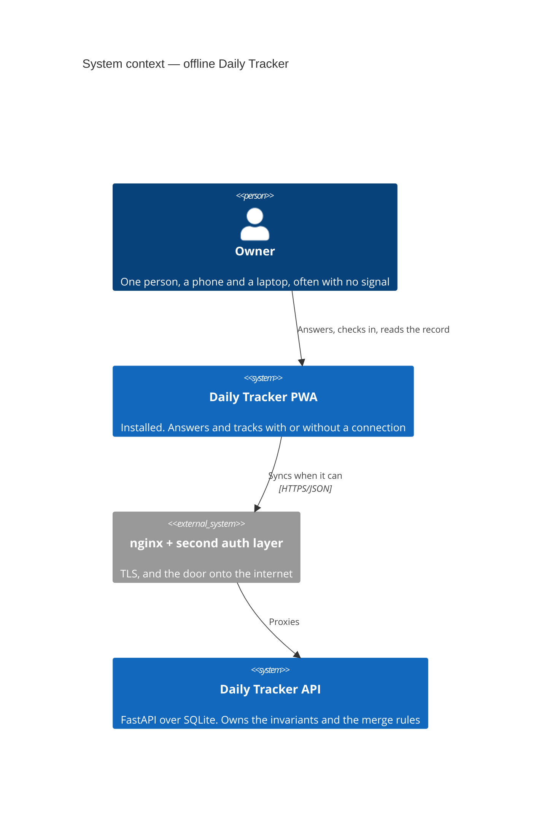
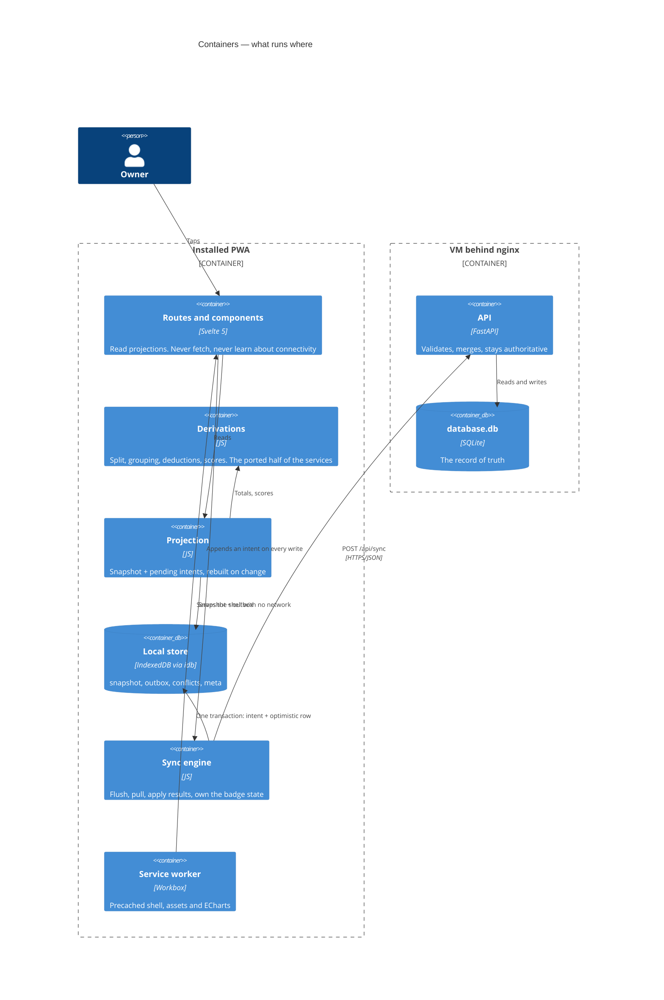
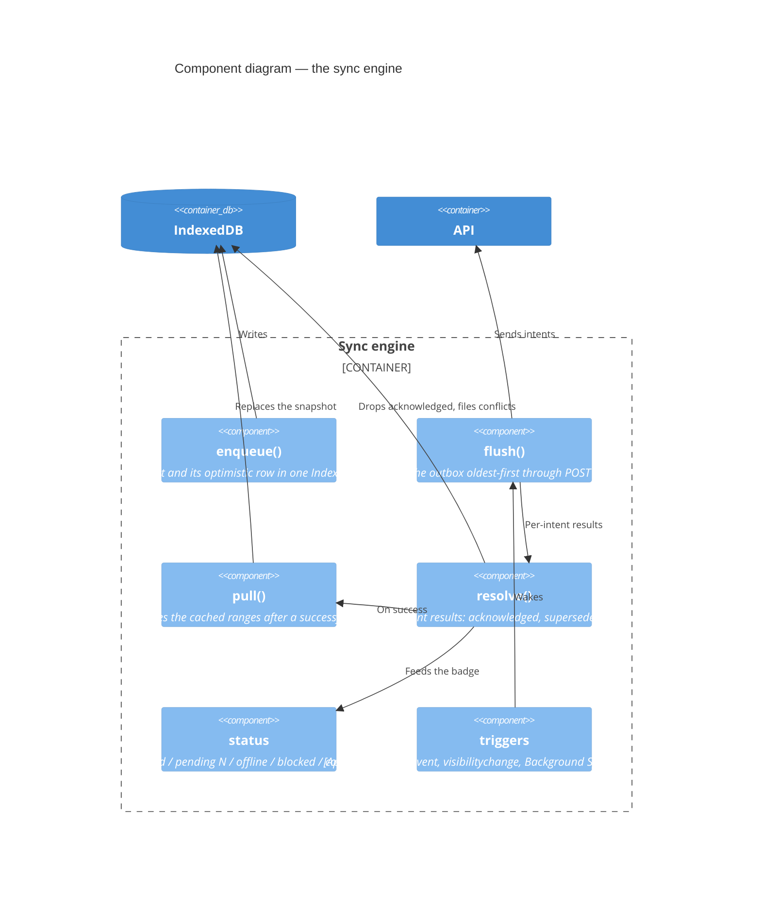

# Offline-first Daily Tracker — plan

*Revised: every question in §13 is answered, and the answers are folded in above them.
Three changed the plan — a recovery path for a dead refresh token (§9), sharper deletion
semantics (§6.1), and a straight answer about creating projects offline (§4.1). Nothing
is left assumed.*

*Supersedes the plan of the same name deleted in `a4a95ad`. That one covered answers
only and predates the entire time-tracking half, which is where the hard parts now
live. What it settled — `vite-plugin-pwa` with a prompted update, IndexedDB via `idb`,
last-write-wins by a client timestamp, telling "offline" apart from "refused" — still
holds and is carried forward rather than re-argued.*

The goal: an installable app that answers questions and tracks time with no connection,
shows the record and the patterns of everything it holds, and reconciles when a
connection returns. Administration — catalogues, projects, tags, rules, people,
settings, the CSV export — is online-only and fails honestly.

---

## 1. The decision that costs the most

Everything else here is standard offline-first machinery. This is the part specific to
this app, and it collides head-on with a rule in `CLAUDE.md`:

> The **server computes it once** and the client reads the result. `/api/time/summary`
> does the split and the grouping so the screen and the exported CSV cannot drift.

Offline, there is no server to do it. Every read view the plan promises depends on
numbers the server currently owns:

| View | Needs | Where it lives now |
| --- | --- | --- |
| Record, by project | Midnight split, day totals | `slices()` — **already mirrored client-side** |
| Record, by tag | Tag regrouping, deductions | `group_by_tag`, `deduction_for`, `reported` |
| Patterns, every window | Daily totals per group | `summarise` + the above |
| Wellbeing record | Auto-tracked answers (weekday, month, year, first hour) | `sync_system_answers`, `_system_values` |
| Wellbeing record + stats | Computed scores | `score_for_day` |
| Stats | Which variables are plottable | `/api/stats/variables` |

Three ways out, and the third is the recommendation:

**(a) Cache the server's answers and accept staleness.** Offline views show what was
computed before the connection dropped; today's offline answers appear in the record but
not in the score, and this afternoon's sessions appear as rows but not in any total.
Cheapest, and it makes the promise false in exactly the situation the feature exists for.

**(b) Compute on the client only for unsynced data**, blending it with cached
server results. Two code paths for every number, and the blend is where the bugs live.
Rejected: it is the most work *and* the least trustworthy.

**(c) Port the derivations to JavaScript, and prove they agree.** One implementation in
`app/src/lib/`, used online and offline alike, with a **conformance test**: a corpus of
fixtures — sessions across midnight and a daylight-saving change, capping and deducting
bands, parallel timers, scores with missing components — run through the Python functions
to produce `app/e2e/fixtures/derivations.json`, then through the JavaScript in a browser,
asserting equality case by case. Regenerating the corpus is a script; a stale corpus is a
failing test.

**(c) is the decision.** The rule in `CLAUDE.md` then reads differently, and should be rewritten when this lands:
*the derivation has one definition and two implementations that a test holds together*.
That is weaker than one implementation, and it is the price of the feature. It is worth
paying only because the ported surface is small — roughly 150 lines: `summarise`,
`group_by_tag`, `deduction_for`, `reported`, `_system_values`, `score_for_day`, and the
variable list. Validation, catalogue shape checks and overlap enforcement stay on the
server, because nothing offline is allowed to write past them.

`/api/time/summary` does not go away. Online it is still what the CSV agrees with; the
client simply stops being unable to answer without it.

---

## 2. Event sourcing: the log, not the projections

Worth answering directly, because half of it is right.

**Adopted — an append-only log of intents.** Every offline write appends to an ordered
`outbox`: `{ seq, kind, client_id, payload, client_updated_at }`. Nothing mutates it;
flushing removes acknowledged entries from the head. Client-generated ids make replay
idempotent, ordering makes "check in, then correct the start time" replay as what
happened, and the log is exactly what the cloud badge has to describe. This is event
sourcing's useful half and the plan uses it wholesale.

**Rejected — event sourcing as the client's source of truth.** Deriving all state from a
local event stream, with snapshots and compaction, and events as the wire format:

- **The server owns invariants a client log cannot decide.** One running session per
  project is a partial unique index; sessions on one project may not overlap. A log that
  believes it is the truth would have to reproduce those rules and could still be
  overruled on flush, so the client needs the reconciliation path regardless.
- **Two independent logs need real convergence semantics.** Once the server also has
  history, "replay both" is a CRDT problem. The requested rule — latest change wins,
  deletions dropped in doubt — is a last-write-wins register, and LWW does not need an
  event store to implement.
- **The shapes are already nearly registers.** An answer is keyed by `(day, question)`
  and upserted; a session is a row keyed by its client id. Both are "current value plus a
  timestamp", not streams.
- Replay and audit, the reasons to reach for ES, are already served by the server's
  database and its `created_at` / `updated_at`.

So: **the log is the transport; the snapshot is the truth.** What the UI reads is a
projection — the last server snapshot with pending intents applied in order — which
gives optimistic updates for free and is thrown away and rebuilt whenever the snapshot
changes. That projection is the only place the two ever mix.

---

## 3. Architecture







**The property worth protecting:** no route and no component learns about connectivity.
`resource()` stays exactly as it is, its loader reads the local store, and a page cannot
tell whether the data behind it arrived a second ago or last Tuesday. Only the badge and
the sync engine know. This keeps the offline feature from spreading into thirty
components as `if (offline)`.

---

## 4. What works offline

| | Offline | Why |
| --- | --- | --- |
| Answering, any day | **Yes** | The write path this was built for |
| Check in, check out, resume | **Yes** | Instants are already stamped client-side (`nowUtc()`) |
| Add, correct, delete a session | **Yes** | Local id, replayed on reconnect |
| Record — both halves, both groupings | **Yes** | Needs §1(c) |
| Patterns and Stats — every window, filter, smoothing | **Yes** | Needs §1(c) |
| Landing page | Yes | |
| Catalogue and question editing | No | Shape validation is the server's, and a queued schema change is a merge nobody wants |
| Projects, tags, colours, **deduction rules** | No | Their *values* are cached and used offline; editing them is not |
| People, settings, password | No | |
| CSV export | No | Server-rendered, and the sessions it would export may be unsynced |

Refusals are stated, not silent: a disabled control with "needs a connection", never a
button that appears to work and drops the write.

### 4.1 Creating a project offline is not the cheap one it looks like

Answered "if it is easy, roll with it" — and it is not easy. The reason is worth stating,
because it is the classic offline-first trap rather than an aversion to the work.

A session references its project **by id**, and a project created offline has none until
it syncs. Supporting it means every intent that points at another entity must point by
*client* id, and `/api/sync` must resolve creations before the rows referencing them —
cross-entity id remapping, with its own failure mode when the referenced create is the one
intent the server rejects. It also opens a conflict class nothing else here has: the same
project created on two devices, which is a merge on a *name* rather than on a timestamp.

Cost: `projects.client_id`, session payloads carrying `project_client_id`, ordering
guarantees inside the sync endpoint, and a rule for duplicate creations. That is a phase
of its own.

**Recommendation: leave it out.** Nothing else changes if it is added later — sessions
already carry client ids, so the extension is additive and cheaper once the machinery
below is working and tested.

---

## 5. Local store

IndexedDB via `idb`, one database, versioned:

| Store | Key | Holds |
| --- | --- | --- |
| `snapshot` | endpoint + range | The last server payload per cached range: answers, entries, projects, tags, catalogues, rules, variables |
| `outbox` | `seq` (auto) | Pending intents, in order |
| `conflicts` | `seq` | Intents the server refused for a reason no rule can settle |
| `meta` | name | `/me`, schema version, last successful sync, last pull per range |

The existing `store.js` keeps its shape — `ensureX` / `rememberX` / `forgetX` — and gains
IndexedDB behind it. Its cache-by-range contract is already the one the snapshot needs,
which is why this is a swap of the bottom half rather than a rewrite.

---

## 6. Merge rules

Every rule below is the requested default — **latest change wins, deletions dropped in
doubt** — made specific per entity. `client_updated_at` is stamped on the device at the
moment of the tap, never at flush time, or a fortnight-old queued answer would arrive
looking newer than yesterday's correction.

| Case | Rule |
| --- | --- |
| Same `(day, question)` answered on two devices | Later `client_updated_at` wins. Equal → keep stored, so a replayed duplicate is a no-op |
| Same session edited on two devices | Later `client_updated_at` wins, matched by `client_id` |
| Deleting a session | Six cases, all in §6.1. In every one of them, **an edit beats a delete** |
| Two devices check into one project | Earliest check-in kept; the later is the same intent said twice |
| Replayed session overlaps another on its project | **Merged into their union** — earliest start to latest end — and the owner is told. §6.2 |
| Session against a project deleted elsewhere | Filed as a conflict; the project is restored by hand or the session reassigned |
| Anything administrative | Cannot conflict: online-only |

### 6.1 Deleting a session

Deletion is the one operation the rule deliberately weakens, so it gets its own table
rather than a line in the one above. The principle underneath every row: **a delete never
beats an edit, in either direction.**

| The delete… | Outcome |
| --- | --- |
| …targets a session created offline and never synced | Both intents collapse in the outbox. Nothing is sent, and the server never hears about either |
| …is newer than every change to the row | **Applied.** The latest decision was to be rid of it |
| …is older than an edit made elsewhere | **Dropped**, row kept, listed. This is the doubt the rule is about |
| …ties with an edit made elsewhere | **Dropped.** A tie is doubt |
| …targets a row already deleted elsewhere | No-op, acknowledged. Replay is idempotent |
| …targets a row whose project was deleted elsewhere | Applied — deleting the session is what unblocks that project's `RESTRICT` anyway |

And the mirror case, which is where this rule earns its keep: **a local edit to a session
deleted elsewhere brings it back.** Every update intent is an upsert keyed by `client_id`,
so a row that is gone is re-created rather than reported as a lost cause. It falls out of
the design rather than being special-cased — the client id is a stable identity that
outlives the server row, which is the whole reason for having one.

The asymmetry is deliberate: a wrongly kept session is a row to delete again, a wrongly
dropped one is data gone. Every dropped delete and every resurrection is listed in the
badge panel rather than only counted.

### 6.2 Overlaps merge into their union

Two sessions on one project covering the same minutes cannot both stand — the server
refuses them, and that refusal is what a replayed offline session runs into. The rule:
**keep the union**, earliest start to latest end, and say so.

Two things make this the right answer rather than a shrug:

- **It invents nothing.** Sessions that *overlap* have no gap between them by definition,
  so their union adds no untracked minute. This is only true because the merge is
  restricted to genuine overlaps; merging two sessions either side of lunch would invent
  the lunch hour, which is exactly what the record's `Merge sessions` view refuses to do.
- **It already exists.** `merge_overlapping` is implemented, tested and reachable from the
  record's "Merge into one" prompt. The sync path reuses it rather than inventing a second
  set of merge semantics, so the offline and online answers to the same collision agree.

Told, not silent: the panel lists what was merged, with both original spans, so a merge
that was not wanted can be undone by hand.

**Clock skew is the known weakness**, unchanged from the earlier plan and worth restating:
a device with a wrong clock orders wrongly and nothing here detects it. Timestamps
implausibly far in the future are rejected, `server_received_at` is kept so the truth is
reconstructable, and this is described as last-write-wins rather than as a CRDT.

---

## 7. Schema and API

**Migrations** (`render_as_batch`, and `tests/test_migrations.py` walks the chain):

- `answers.client_updated_at` — nullable, backfilled from `updated_at`.
- `time_entries.client_id` — string uuid, unique per user, backfilled with generated ids.
- `time_entries.client_updated_at` — as above.
- `answers.server_received_at`, `time_entries.server_received_at` — for diagnosis.

**One new endpoint** rather than a batch per resource:

```
POST /api/sync
  { "intents": [ { "seq", "kind", "client_id", "payload", "client_updated_at" } ] }
  → { "results": [ { "seq", "outcome": "applied|superseded|conflict", "detail", "row" } ],
      "server_time": "..." }
```

Per-intent results, so one rejected session cannot wedge the queue behind it — the
failure mode the earlier plan called out and the reason this is not a transaction. The
merge rules live here, in one module, tested directly.

Pull stays the existing GETs over the ranges the client caches. No tombstones and no
delta protocol: at this data volume a full range refetch is cheaper than the machinery,
and the first `ensureTimeEntries` already fetches the whole history in one request.

---

## 8. The badge

A small cloud beside `DT` in the header, in the shared zone (`App.svelte`), with five
states and one job — never let a queue grow silently:

| State | Cloud | Means |
| --- | --- | --- |
| Synced | Plain outline | Nothing pending. The default, and quiet |
| Pending *n* | Outline with a dot, count beside it | *n* changes live only on this device |
| Offline | Slashed | No connection; writes are being kept |
| Blocked | Slashed, `border-ember` | `navigator.onLine` is true and every request fails — an expired certificate or a proxy refusal, **not** a lost signal |
| Conflicts | `border-ember` with a count | Something needs a decision |

Tapping it opens a panel: what is waiting, what failed and why, a `Sync now`, and the
last successful sync. `aria-live="polite"` on the count, because "your data is only here"
is exactly the kind of thing a screen reader user is currently not told.

---

## 9. Auth, offline

Today `unwrap()` answers a 401 by clearing tokens and calling
`window.location.replace('/login')`. With an outbox that is a data-loss path.

- **The outbox and the snapshot survive sign-out.** Only tokens are cleared.
- A 401 **never** discards pending intents. Signing out with a queue shows
  "n changes waiting to sync" and keeps them until the same account signs back in.
- A 401 from the app and a 401 from the proxy are different events on different code
  paths — the second is `blocked`, not an expired session.
- No response at all is `offline`, and must not reach a toast on every attempt.
- **First run needs a connection.** No offline login and no catalogue to answer against
  until one has been fetched. Documented, not engineered around.
- Access 1h / refresh 30d means a month offline ends with a dead refresh token.
  `REFRESH_TOKEN_TTL` rises to 90 days.

### 9.1 Coming back after the refresh token has died

Raising the TTL shortens the odds; it does not remove the case, and the case that matters
is the unlucky one — going offline holding a token that was nearly expired already. The
requirement is that the owner can sign back in **without losing what the device holds**.

- **The outbox is keyed by account id** and survives sign-out, token expiry, app restarts
  and service worker updates. Only tokens are ever cleared.
- A dead refresh token cannot be discovered offline — there is nothing to ask. Answering
  and tracking carry on untouched until a connection returns.
- On reconnect the flush gets a 401 that refresh cannot mend. The queue is **not**
  discarded and the session is **not** replaced out from under a half-typed session: the
  badge goes to `blocked`, reading "sign in to sync *n* changes", and that is the only
  thing that changes on screen.
- Signing in as **the same account** resumes the flush automatically. The intents were
  stamped with `client_updated_at` at the moment of the tap, so three weeks in the queue
  does not make them look newer than they are.
- Signing in as a **different account** parks the queue rather than replaying it into the
  wrong person's data — every intent carries the account it was made under, and the badge
  says a queue is waiting for someone else.
- The promise is "no data loss", not "sign in offline": recovery needs a connection,
  because authentication does.

---

## 10. Testing

The requirement is the interesting part: *losing connectivity at any point in the normal
workflow is tolerated, except the initial page load.* That is a matrix, so it is
generated rather than written out.

**The interruption matrix.** Each workflow is a list of named steps. For each step *k*,
one test goes offline before *k*, runs the workflow to the end, reconnects, flushes, and
asserts the server holds exactly what the workflow described — and the badge is back to
synced.

```js
for (const [name, steps] of Object.entries(WORKFLOWS)) {
  for (let k = 0; k < steps.length; k += 1) {
    test(`${name}, offline from step ${k + 1} (${steps[k].name})`, async ({ page, context }) => {
      for (const [at, step] of steps.entries()) {
        if (at === k) await context.setOffline(true)
        await step.run(page)
      }
      await context.setOffline(false)
      await expectSynced(page)
      await expectServerMatches(account, steps)
    })
  }
}
```

Workflows: answering a full day; check in, work, check out; adding a session by hand;
correcting one; deleting one; scrolling the record back through several weeks; stepping
the patterns windows; moving between all six pages. Roughly 60 generated cases, each
cheap.

**Beyond the matrix:**

- Cold launch offline, installed → the shell renders from the service worker.
- Reload mid-workflow while offline → nothing queued is lost.
- **Conformance**: the Python and JavaScript derivations agree, case by case, over the
  fixture corpus of §1(c). This is the test that keeps the port honest, and it must fail
  loudly when either side changes.
- Two contexts as two devices, one test per row of §6, both offline, reconnecting in
  either order — the later timestamp survives regardless of arrival order.
- Token expiry offline → reconnect refreshes and flushes; never bounced to login holding
  pending data.
- **The refresh token dies while offline** → reconnect shows `blocked`, the queue is
  intact, signing back in as the same account drains it, and the server ends up holding
  every offline change. The unlucky case of §9.1, and the one most likely to be met once
  and never again.
- Signing in as a *different* account with a queue pending → nothing is replayed into it.
- A delete replayed against a newer edit → the session survives and is listed.
- A delete replayed against an older edit → applied.
- **An edit to a session deleted elsewhere → the session comes back** (§6.1), with its
  original `client_id`.
- Create-then-delete offline → both intents collapse; the server never sees either.
- An overlapping session replayed → merged to the union, both original spans listed, and
  the total is the union rather than the sum.
- Service worker update mid-session → prompted, no data loss, the outbox survives.
- `expectSettled()` still passes on every page, now reading IndexedDB.

Each of these is broken deliberately once and watched failing, per the house rule — the
sync engine is precisely the kind of code that passes tests it does not implement.

---

## 11. Build order

| Phase | Contents | State |
| --- | --- | --- |
| 0 | `client_id` + `client_updated_at` migrations, `POST /api/sync` with the merge rules of §6, `vitest` wired up, backend tests for every rule including §6.1 | **Done** |
| 1 | IndexedDB behind `store.js`; every page reads the snapshot; still online-only | **Done** |
| 2 | Outbox, optimistic projection, the badge; writes stop waiting on the network | **Done** |
| 3 | Derivations ported, conformance corpus and test; Record and Patterns stop needing the server | **Done** |
| 4 | `vite-plugin-pwa`, manifest, icons, precache, install on both phones; ECharts route-split so the first paint stays quick | **Done** (route-split still open) |
| 5 | Auth hardening: §9.1 recovery, queue keyed by account, blocked-state detection, conflict panel | **Done** |
| 6 | The interruption matrix, two-device tests, `navigator.storage.persist()`, iOS pass | **Done** except the iOS pass, which needs a phone |

**Phase 0, as built.** One migration (`b1c4e7a90d21`) adds the clocks and identities and
backfills every existing row; `POST /api/sync` takes a queue and answers per intent;
`services/sync.py` holds the rules of §6 and §6.1 and nothing else. Seventeen backend
tests, one per rule, plus the two that matter most for a flaky connection — replaying a
queue twice changes nothing, and one refused intent does not block the rest. `vitest` runs
`pnpm test`.

**Phase 1, as built.** `lib/local.js` wraps `idb` and degrades to a no-op wherever
IndexedDB is missing or refuses. `store.js` hydrates from it once per page load, persists
every change through one subscription per store, and marks each value as *seen this
session* — a restored snapshot is what the app had, never what it knows, so the first
`ensure` still asks the server and replaces it. No component changed, and no page learned
about any of it.

The subtlety that cost two rounds: **whose snapshot it is has to be decided before a byte
of it is restored.** Checking the owner after `ensureMe` answered meant undoing a restore
already in progress, which raced every loader running alongside it — and losing that race
shows one account another's data. The account id now comes from the `sub` claim of the
token the device already holds, which is available with no round trip; nothing is
authorised on it, it only decides whether to keep or wipe.

**Phase 2, as built.** The outbox is an IndexedDB store of its own (`local.js` v2), the
engine is `lib/sync.js`, and the badge sits beside the mark in the header with the five
states of §8. Answering now goes through it: the answer is on the device before the tap
returns, and reaches the server whenever there is one. A 500 from the server no longer
loses what was typed — it stays queued and the badge says so, where the old path reported
a toast and dropped it. Sessions go the same way: checking in, checking out, resuming, adding by hand,
correcting and deleting are all one intent — a session under the device's own identity,
with or without an end — so a timer started with no signal is running as far as the phone
is concerned and lands when there is one.

Two rules moved to the server as a consequence, and both are better there. The record's
overlap prompt is gone: an overlap is merged into the union by §6.2 and reported in the
panel, which is the same answer the prompt used to ask for and one that also works with
no connection. And every session now carries a `client_id` whatever created it — defaulted
on the model — because a session the device cannot name is one it could never correct
offline.

A third bug, and the one worth remembering: **the UI claimed success before the write was
durable.** Deleting a session and navigating away in the same breath lost it, because the
local store updated first and the IndexedDB transaction was still committing when the page
went. Enqueue now happens *before* the screen is told. The order is the whole point — the
local copy is a cache that can be rebuilt from the server and the queue, while the queue
is the only copy of what was just done.

**The projection is the part that has to be right, and it took three attempts.** Each
time, the same shape of bug: something read the server's answer and wrote it over the
queue.

1. The day re-read that collects the auto-tracked values replaced the whole day, dropping
   the answer that triggered it — a day went blank the moment it was answered on a slow
   connection.
2. A cold page load refetched before the queue had been read off the disk, so the
   projection ran against an empty queue and erased what had not been sent. The queue is
   now loaded inside `ready()`, which every loader already awaits.
3. `ensureAnswers` stored the projected rows but *returned* the server's, and the record
   builds its rows from the return value — so the record showed a day it had an answer
   for as empty.

None of the three would have shown up online, and none of them would have been visible in
a passing test suite: the answer is there a moment later, once something refetches. That
is the argument for the interruption matrix in §10 rather than a handful of offline tests.

**Phase 3, as built.** The ports live in their own zones — `lib/time/summary.js` for
totals, tag grouping and deductions, `lib/wellbeing/derive.js` for auto-tracked values and
scores — and `backend/scripts/dump_derivations.py` writes the corpus that holds them to
the Python: 53 cases, 70 assertions, run by `pnpm test`. Sessions across midnight, two
clocks after a flight, a running timer, capping bands, a deduction larger than the day,
weights summing to zero, a leap day. Breaking three of the ports on purpose failed ten
cases, which is the only evidence that corpus is worth anything.

`ensureSummary` now falls back to working the totals out here when the server cannot be
reached, and Patterns fetches the raw sessions and rules it never used to need — a page
that only ever held somebody else's arithmetic has nothing to fall back on.

**The projection had to become reactive**, and that is the phase's real lesson. Applying
the queue once at fetch time is not enough, because the things it depends on arrive
separately: the auto-tracked rows need the catalogues, which load after the answers. A day
answered offline was missing its weekday until something happened to refetch. It is now
rebuilt whenever the queue or the catalogues change — and the baseline it is laid over
advances as writes are accepted, or a correction reverted on screen the moment the queue
drained.

**Phases 4 to 6, as built.** `vite-plugin-pwa` precaches the shell and ECharts — 13
entries, 1.5 MB — with a prompted update, a manifest with relative `start_url`, and icons
drawn by hand rather than pulled in as a toolchain. `navigator.storage.persist()` is
asked for on start. The interruption matrix generates 14 cases across three workflows,
and the auth recovery of §9.1 has two tests using a *real* expired session — the admin
resetting the account's password — rather than a stubbed 401, because requests a service
worker mediates cannot be intercepted from a test anyway.

Three things the last three phases taught:

- **`navigator.onLine` is not connectivity.** It says whether the device has an interface,
  not whether anything answers on it: it reads `true` on a train, in a tunnel, and in
  Playwright with the context offline. Connectivity is now learned from requests that
  actually fail, which is also what lets the badge tell "offline" from "the server
  refused this device".
- **A failed read must not overwrite what the device holds.** Every loader used to end
  `?? []`, so the first fetch after an offline reload replaced a good snapshot with
  nothing — the record opened empty on the one occasion the snapshot existed for.
- **A prompted worker does not control the page that registered it.** That is the
  difference between asking and taking over mid-session, and it is why the tests wait for
  an *active* registration rather than a controller.

Two things the building taught, both folded in above:

- **A malformed intent is a per-intent conflict, not a 422.** An old app version or a
  payload mangled in storage must still let the fortnight of answers behind it through,
  which is the same argument that made results per-intent in the first place.
- **`payload` had to become typed.** It started as a bare `dict` and beartype caught what
  that hides: `started_at` arriving as a string, straight past every rule that compares
  instants. Each kind now validates into its own model before any rule sees it.

Phases 0–2 are useful on their own: they make every write optimistic and every page
instant, which is worth having whether or not the service worker ever ships.

---

## 12. Risks

- **The two implementations drift.** Mitigated by the conformance test, and by nothing
  else. If that test is ever skipped, this plan's central promise stops holding.
- **iOS evicts storage.** Answers live only on the device until they sync. Request
  persistence; consider an offline JSON export before a long trip.
- **A service worker is sticky.** Ship a broken one and clients keep it. Prompted
  updates, and the upgrade path gets a test, not just the install.
- **Silent queue growth** is worse than a loud error — which is what the badge is for.
- **Scope creep into offline administration.** Every "it would be nice if projects worked
  offline too" adds a class of conflict. The line in §4 is the plan.

---

## 13. Decisions

Every question this document opened with, as answered:

1. **Offline stats reflect unsynced data immediately** — catching up on sync is not
   acceptable. This is what §1(c) buys and why it is worth its price.
2. **`vitest` is added**, for the conformance corpus and for the derivations themselves.
3. **`idb`** is the IndexedDB wrapper.
4. **`REFRESH_TOKEN_TTL` rises to 90 days**, plus the recovery path in §9.1 for the
   unlucky case it does not cover.
5. **One device is the norm** — a phone. Two devices must not lose data or crash, but
   §6 is a correctness floor rather than a hot path to optimise.
6. **Conflicts resolve automatically wherever a rule can decide**, and everything decided
   is listed in the badge panel. No modal.
7. **Projects stay online-only** — §4.1 explains why "if it is easy" turns out not to be.
8. **Deleting works offline**, with the semantics in §6.1: an edit always beats a delete,
   in both directions.
9. **Notifications: not now.**

Everything above is written to match. This is what gets built.
