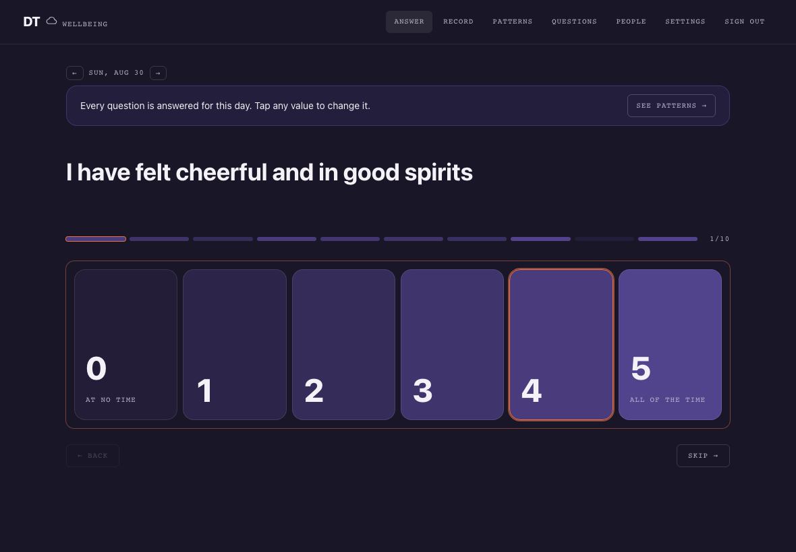
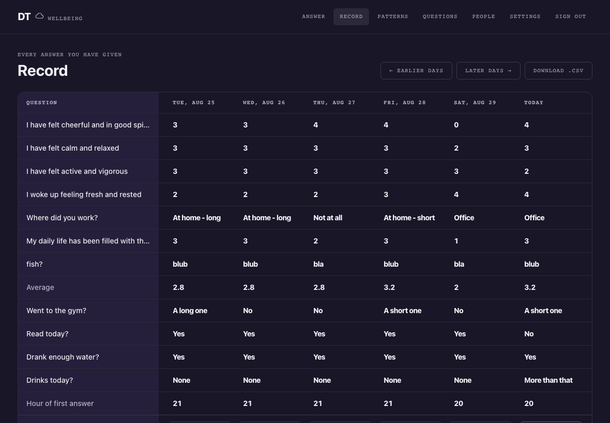
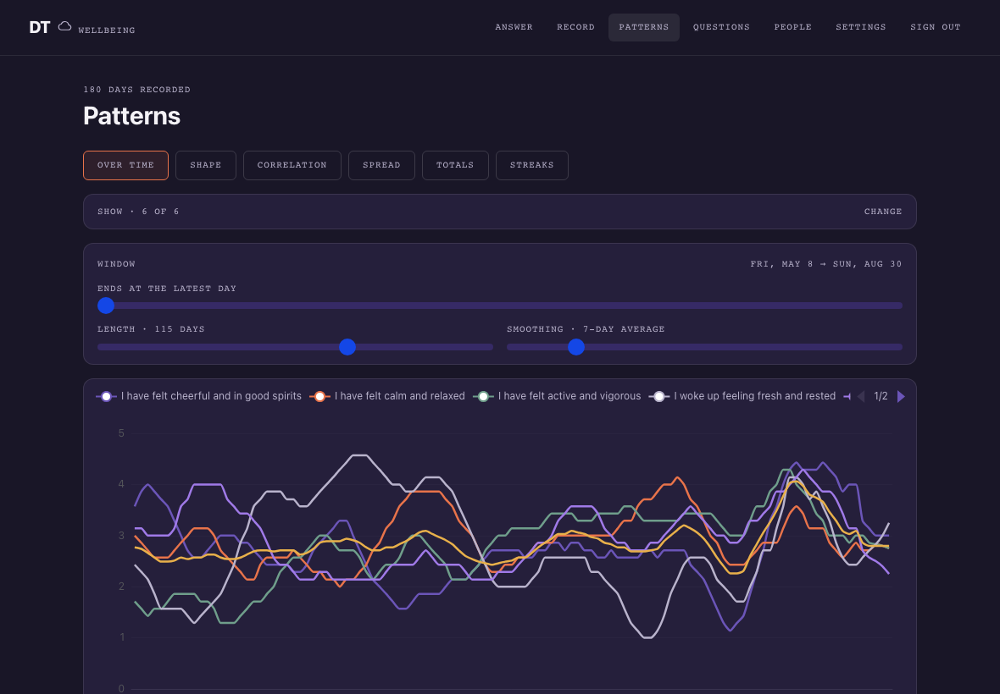

# Happiness tracker

Track your satisfaction with work/life/whatever in regular questionaries, then get automated statistics.

## Screenshots

Answering: one tap per question, and the next one opens without waiting for the server.



The record: every answer you have given, days running left to right, with a button to fill in any past or future day.



Patterns: line, radar, scatter and box views over a window you choose, with a smoothing control that trades daily detail for trend.



## Scores

A catalogue can define a score: a total or an average over the questions you pick,
each with a weight. It behaves like any other question — it appears in the record,
the export and the plots — except that nobody answers it. It is worked out from the
answers every time they are read, so editing a definition applies to everything
already recorded and no stored answer is ever rewritten. By default a day is scored
only when every question feeding it was answered.

The starter catalogue ships with the WHO-5 raw score, defined as ordinary catalogue
data. Scores are edited under **Questions**, below the question list.

## Installation

To install everything, just build the Dockerfile and run through docker. You may want to set some environment variables:

- `PORT` - the port exposed, by default 8000
- `DB_STORAGE` - Where the sqlite .db file is stored, by default database.db
- `ADMIN_USER` - The username of the initial admin acccount (default: `admin`)
- `ADMIN_PASSWORD` - **Required on a fresh install.** The password of the initial admin account. There is no default: an installation that forgets it fails to start rather than coming up with a guessable administrator. Only consulted while that account does not yet exist.
- `BOOTSTRAP_QUESTION_CATALOGUE` - If you want to bootstrap an initial catalogue of questions as a default (0/1)
- `JWT_SECRET` - **Required.** The key used to sign session tokens. The server refuses to start without one, because a generated key would sign every user out on each restart and give each worker of a multi-worker deployment a different key. Generate one with `python -c 'import secrets; print(secrets.token_urlsafe(48))'`.
- `ACCESS_TOKEN_TTL` - How long a session token stays valid before it has to be refreshed, by default 1h
- `REFRESH_TOKEN_TTL` - How long a user stays logged in without re-entering their password, by default 30d
- `PASSWORD_MIN_LENGTH` - Minimum length of a user password, by default 8

After installation, you want to define the questions that will be answering regularly. Questions are grouped in catalogues and every user has a default catalogue that will be automatically opened when he/she logs in.

## Development

In production one FastAPI process serves both the API and the compiled frontend. For development you run two processes instead, so that each half reloads on its own: the backend on `:8000` and the Vite dev server on `:5173`. **Use `http://localhost:5173` in the browser** — it proxies `/api` to the backend, so there is no CORS setup and no rebuild step between edits.

Prerequisites: [uv](https://docs.astral.sh/uv/) for the backend and [pnpm](https://pnpm.io/) for the frontend.

**Terminal 1 — backend, reloads on every `.py` save:**

```bash
cd backend
uv sync                      # first time only
uv run alembic upgrade head  # first time, and after pulling new migrations
JWT_SECRET=dev-secret ADMIN_PASSWORD=dev-admin-password uv run fastapi dev
```

Both variables are required. `JWT_SECRET` has no default because a generated one would sign every user out on each restart and give each worker of a multi-worker deployment a different key. `ADMIN_PASSWORD` has none because an installation that forgets it should fail loudly rather than come up with a guessable administrator; it is only consulted when the account does not yet exist.

The server does not create tables on its own either — starting against an unmigrated database fails with `no such table`, rather than quietly building a schema no migration accounts for. The admin account and the default catalogue *are* created on first start, once the tables exist.

**Terminal 2 — frontend, hot module reloading:**

```bash
cd app
pnpm install                 # first time only
pnpm dev
```

Then open http://localhost:5173 and sign in with `ADMIN_USER` / `ADMIN_PASSWORD` (`admin` / `dev-admin-password` with the command above). Svelte components swap in place without losing page state; the backend restarts on save and the browser picks it up on the next request.

Useful extras:

```bash
cd backend && uv run pytest    # the API test suite
cd backend && uv run python scripts/seed_answers.py --days 90   # a history to look at
cd app && pnpm build           # emit the production bundle into backend/static
cd app && pnpm api:generate    # regenerate the typed API client after an endpoint changes
```

### The generated API client

The frontend does not hand-write URLs or field names. `pnpm api:generate` dumps the
backend's own OpenAPI document and generates a typed client into
`app/src/lib/generated/`, which every page calls through. Run it after adding or changing
an endpoint; the generated files are committed, so a clean checkout builds without a
backend running.

Around it sit two small modules worth knowing:

- `src/lib/api.js` holds the session — token storage, one shared refresh when several
  calls hit a 401 together, and turning a FastAPI error body into a sentence naming the
  field that was wrong.
- `src/lib/store.js` holds the data every page needs — the account, catalogues and the
  answer history — loaded once and shared, so moving between pages does not refetch and
  no two views disagree.

### End-to-end tests

Playwright drives a real browser against the app as it ships — one FastAPI process
serving both the API and the built frontend, not the two dev servers.

```bash
cd app
pnpm exec playwright install chromium   # first time only, ~180 MB
pnpm e2e
```

That builds the frontend, migrates a throwaway database at `/tmp/happiness-e2e.db`,
starts a server on port 8123, runs the suite, and shuts everything down. It touches
neither your development database nor a running dev server, so it is safe to run at any
time. It is deliberately not wired into any commit hook — `uv run pytest` is the check
worth running constantly; this one you run when you want it.

```bash
pnpm e2e:ui       # pick and step through tests interactively
pnpm e2e:report   # open the HTML report from the last run
pnpm exec playwright test e2e/answering.spec.js   # one file
pnpm exec playwright test --grep "double tap"     # one test by name
```

A failing run keeps a trace and a video under `app/test-results/`; open the trace with
`pnpm exec playwright show-trace <path>` to step through the failure frame by frame.

Two things the suite pins down deliberately, worth knowing before adding to it: the clock
is set to 2026-06-15 in `Europe/Berlin`, because "today" is computed in the browser and an
unpinned suite fails around midnight — set, not *frozen*, since stopping time also stops
anything that animates from time deltas, and a canvas chart then draws its axes and no
data at all; and each test gets its own freshly created user,
because answers are per-user and that is what keeps tests from seeing each other's data.
Take the catalogue by name rather than "the first one" — the listing is alphabetical, and
a test that creates a catalogue would otherwise change what later tests answer.

Once `pnpm build` has run, `uv run fastapi dev` alone serves the built frontend on `:8000` too, which is the quickest way to check the single-process setup behaves the same as in Docker. Delete `backend/static` to go back to backend-only mode.

## Migrations

The schema is versioned with [Alembic](https://alembic.sqlalchemy.org/), from `backend/`.

**In Docker, migrations apply themselves.** The container runs `alembic upgrade head` before the server starts, so pulling a new image and restarting is all an upgrade takes. Point `DB_STORAGE` at a mounted volume and take a copy of that file before upgrading — SQLite schema changes are applied in place.

**Applying migrations by hand:**

```bash
cd backend
uv run alembic upgrade head     # apply everything outstanding
uv run alembic current          # which revision the database is on
uv run alembic history          # every revision, newest last
uv run alembic downgrade -1     # step one revision back
```

**Writing one after changing a model:**

```bash
cd backend
uv run alembic revision --autogenerate -m "what changed"
```

Read the generated file before committing it. Autogenerate detects tables, columns and indexes, but it does not see data: converting a column's meaning, backfilling a new `NOT NULL`, or splitting a table needs those statements written by hand. It also cannot infer a `downgrade()` for a data change. SQLite cannot `ALTER` most things, so `env.py` sets `render_as_batch=True` and Alembic rewrites the table instead — the generated code will show `batch_alter_table` blocks. That rewrite is a `DROP` and a rename, which is why `env.py` also turns foreign key enforcement off while migrating: with it on, dropping `questions` cascades and takes every answer and option with it. `tests/test_migrations.py` migrates a populated database along the whole chain and fails if any revision loses a row. Apply, then `downgrade` and `upgrade` again to confirm the migration works in both directions before you commit.
